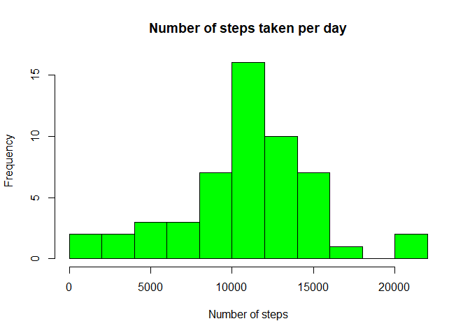
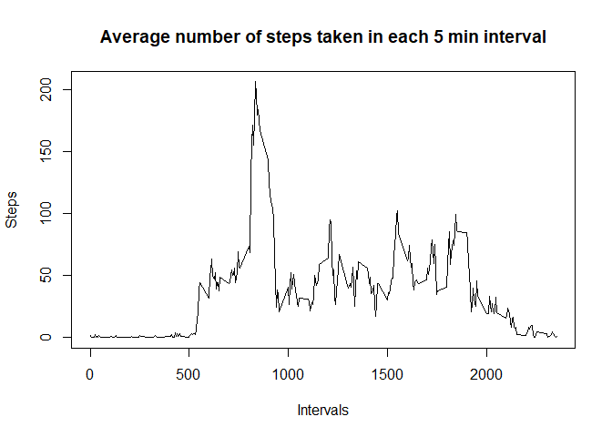
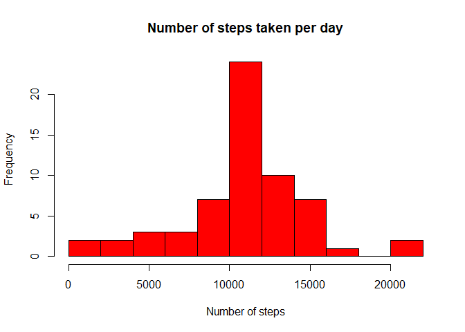

```
## 
## Attaching package: 'dplyr'
```

```
## The following objects are masked from 'package:stats':
## 
##     filter, lag
```

```
## The following objects are masked from 'package:base':
## 
##     intersect, setdiff, setequal, union
```

```
## Warning: package 'ggplot2' was built under R version 4.0.2
```

## Loading and preprocessing the data


```r
activity_data <- read.csv( "activity.csv" )
```

## What is mean total number of steps taken per day?

### Calculate the total number of steps taken per day


```r
sums <-aggregate( activity_data$steps, by=list(activity_data$date), FUN=sum)
```

### A histogram of the total number of steps taken each day

```r
hist(sums$x, col="green", breaks=10, main="Number of steps taken per day", 
          xlab="Number of steps")
```

<!-- -->

### Calculate and report the mean and median of the total number of steps taken per day


```r
daily_mean <- mean( sums$x,na.rm=TRUE)
daily_median <- median( sums$x,na.rm=TRUE)
```
Mean of daily number of steps : 10766.1886792  
Median of daily number of steps : 10765

## What is the average daily activity pattern?

```r
interval_means <-  activity_data %>% group_by( interval) %>%
         summarize( steps = mean(steps, na.rm = TRUE))
df_means <- data.frame( interval_means)

plot( df_means, ylab="Steps", xlab="Intervals", type="l",
      main="Average number of steps taken in each 5 min interval")
```

<!-- -->

```r
maxStepInterval = which.max(df_means$steps)
```
The 5 minute interval with the highest average step count starts at 835.

## Imputing missing values

### Calculate and report the total number of missing values in the dataset

```r
missing_steps <- sum( is.na( activity_data$steps ) )
```
Number of missing values : 2304

### Strategy to fill in missing data: use the average of the same interval


```r
activity_complete <- activity_data
for( row in 1:nrow(activity_data)) {
    act_row <- activity_complete[row,]
    if( is.na(act_row$steps) ) {
        activity_complete[row,]$steps = df_means[ df_means$interval == act_row$interval,]$steps
    }
}
```

### Histogram of the total number of steps taken each day, using updated dataset

```r
sums_complete <-aggregate( activity_complete$steps, by=list(activity_complete$date), FUN=sum)
hist(sums_complete$x, col="red", breaks=10, main="Number of steps taken per day", 
          xlab="Number of steps")
```

<!-- -->

```r
daily_mean_complete <- mean( sums_complete$x)
daily_median_complete <- median( sums_complete$x)
```
New Mean of daily number of steps : 10766.1886792  
New Median of daily number of steps : 10766.1886792  

The impact of imputing missing data on the calculation of the above values is negligable.

## Are there differences in activity patterns between weekdays and weekends?

### New factor variable in the dataset with two levels – “weekday” and “weekend”


```r
# Convert dates to Date class
activity_complete$date <- as.Date( activity_complete$date )

activity_updated <- activity_complete %>% 
    mutate( daytype = ifelse(weekdays(date)=="Saturday" | weekdays(date)=="Sunday" , "weekend", "weekday")) %>%
    group_by( interval, daytype ) %>%
    summarize( steps = mean(steps))
```
### A panel plot containing a time series plot of the 5-minute interval (x-axis) and the average number of steps taken, averaged across all weekday days or weekend days (y-axis)

```r
qplot( interval, steps, data=activity_updated, facets=daytype~., geom=c("line") )
```

<!-- -->
